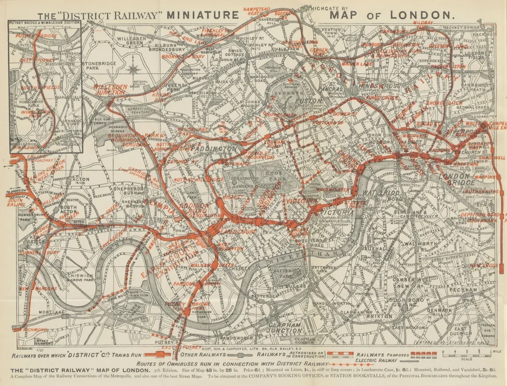
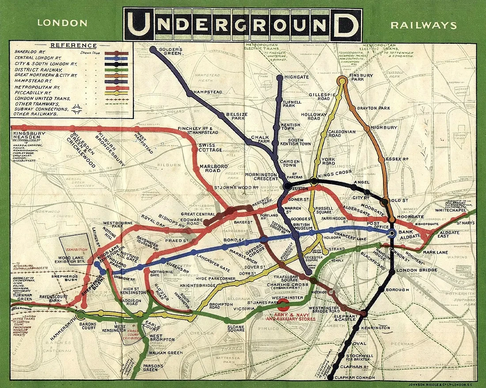
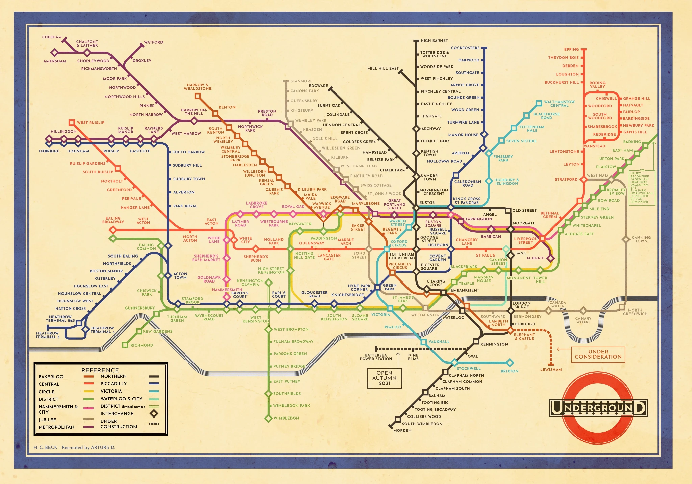

<!doctype html>
<html lang="es">
<head>
    <meta charset="UTF-8">
    <meta name="viewport" content="width=device-width, initial-scale=1.0">

    <title>Harry Beck — Diseño y Visualización de Información</title>

    
</head>

<body>

    <nav>
        

            
                <strong>Diseño y Visualización de Información</strong>
            

            
                Evaluación diagnóstica 1
            
        

    </nav>

    <header class="contenedor">

        <h1>
            Harry Beck’s London Underground Map (1931)
        </h1>

        

            Diseño en torno a la funcionalidad
        

        

            Fernanda Valenzuela · Martina Casas · Marthin Rivera ·
            Gonzalo Monsalves · Violeta Santander
        

    </header>

    <main class="contenedor">

        <article>

            <!-- INTRODUCCIÓN -->

            <section>

                

                    El mapa del metro de Londres, diseñado por Harry Beck,
                    se convirtió en una referencia mundial porque logró
                    simplificar una red de transporte cada vez más compleja.
                

            </section>

            <!-- CONTEXTO -->

            <section>

                <h2>Contexto de la pieza</h2>

                

                    El primer ferrocarril subterráneo del mundo fue el
                    Metropolitan Railway de Londres, inaugurado en 1863.
                    Su objetivo era reducir la congestión del tráfico
                    provocada por el crecimiento de la ciudad durante
                    la Revolución Industrial.
                

                

                    Los primeros mapas imitaban la geografía real de Londres
                    para relacionar las líneas del metro con las calles de la
                    superficie. Con la expansión del servicio, esta decisión
                    comenzó a dificultar la lectura, especialmente en la
                    zona central.
                

                <!-- IMAGEN 1897 -->

                <figure>

                    

                    <figcaption>
                        Mapa del metro de Londres, 1897.
                    </figcaption>

                    

                        <strong>Descripción de la imagen:</strong>
                        mapa antiguo de Londres con una gran cantidad de
                        calles y nombres impresos. Las rutas ferroviarias
                        aparecen superpuestas sobre la geografía real de
                        la ciudad, principalmente mediante líneas rojas,
                        lo que produce una imagen visualmente densa.
                    

                </figure>

                

                    <strong>El problema comienza a aparecer</strong>

                    

                        La precisión geográfica permitía relacionar el metro
                        con la superficie, pero a medida que aumentaban las
                        líneas, la información se acumulaba y el centro del
                        mapa se volvía difícil de leer.
                    

                

                <!-- IMAGEN 1908 -->

                <figure>

                    

                    <figcaption>
                        Mapa de bolsillo del metro, 1908.
                    </figcaption>

                    

                        <strong>Descripción de la imagen:</strong>
                        mapa de Londres con varias líneas de metro
                        diferenciadas por color. Las líneas siguen recorridos
                        irregulares sobre una base geográfica detallada; en el
                        centro se cruzan numerosas rutas y nombres, generando
                        una alta concentración visual.
                    

                </figure>

            </section>

            <!-- PROPUESTA DE BECK -->

            <section>

                <h2>La propuesta de Harry Beck</h2>

                

                    En 1931, Beck propuso un diagrama que ya no buscaba
                    representar con exactitud la geografía de Londres.
                    Utilizó líneas horizontales, verticales y diagonales
                    de 45°, priorizando las relaciones entre estaciones
                    por sobre las distancias reales.
                

                <!-- IMAGEN BECK -->

                <figure>

                    

                    <figcaption>
                        Mapa de bolsillo del metro, por Harry Beck, 1933.
                    </figcaption>

                    

                        <strong>Descripción de la imagen:</strong>
                        diagrama del metro compuesto por líneas rectas de
                        distintos colores conectadas mediante estaciones.
                        La geografía de Londres casi desaparece y la red
                        se organiza de forma limpia, utilizando principalmente
                        direcciones horizontales, verticales y diagonales
                        de 45°.
                    

                </figure>

                <!-- COMPARACIÓN -->

                

                    

                        <h3>Antes</h3>

                        

                            El mapa privilegiaba la fidelidad geográfica
                            y mostraba calles, distancias y recorridos reales.
                        

                    

                    

                        <h3>Con Beck</h3>

                        

                            El mapa privilegia la comprensión del sistema:
                            estaciones, conexiones y cambios de línea.
                        

                    

                

            </section>

            <!-- FUNCIÓN -->

            <section>

                <h2>Función de la pieza</h2>

                

                    El mapa resolvió el problema de saturación de la zona
                    central. Beck, que trabajaba como dibujante técnico,
                    aplicó una lógica semejante a la de los diagramas
                    eléctricos y entendió que el usuario no necesitaba
                    conocer la distancia exacta entre las calles, sino
                    comprender con rapidez cómo se conectaban las estaciones.
                

                

                    <strong>Decisión de diseño</strong>

                    

                        Reducir la fidelidad geográfica para aumentar la
                        legibilidad. La forma deja de imitar el territorio
                        y comienza a representar el funcionamiento de la red.
                    

                

            </section>

            <!-- LEGADO -->

            <section>

                <h2>Legado</h2>

                

                    La lógica visual de Beck continúa presente en los mapas
                    de metro de todo el mundo. Su aporte demuestra que una
                    pieza de información puede ser más útil cuando selecciona,
                    ordena y jerarquiza aquello que el usuario realmente
                    necesita.
                

                

                    <em>
                        El diseño no siempre necesita llamar la atención:
                        muchas veces su mayor logro es hacer que una acción
                        compleja parezca sencilla.
                    </em>
                

            </section>

        </article>

    </main>

    <footer>
        Jueves 20 de agosto, 2026
    </footer>

</body>
</html>
